# Authentication Flow & Route Guards Guide

## Overview

This guide explains how authentication works in RocketHooks, including user flows, route protection, and the guard system implementation. The application uses Clerk for OAuth authentication with GitHub and Google providers.

## Table of Contents

- [Authentication Flows](#authentication-flows)
- [Key Components](#key-components)
- [Route Protection Matrix](#route-protection-matrix)
- [Implementation Details](#implementation-details)
- [Smart Behaviors](#smart-behaviors)

## Authentication Flows

### Flow 1: New User (First-Time Sign Up)

```mermaid
graph TD
    A[User visits protected route /dashboard] --> B{ProtectedRoute guard checks}
    B -->|Not authenticated| C[Redirect to /login with return URL saved]
    C --> D[User clicks 'Sign in with GitHub']
    D --> E[Clerk OAuth flow - GitHub authorization]
    E --> F[GitHub redirects back to /auth/callback]
    F --> G{AuthCallback detects new user}
    G -->|Created < 60 seconds ago| H[Shows welcome toast: 'Welcome to RocketHooks! 🎉']
    H --> I[Redirects to /onboarding/1]
    I --> J[User completes onboarding steps]
    J --> K[Redirects to /dashboard or saved return URL]
```



### Flow 2: Returning User


### Flow 3: Already Authenticated User


### Flow 4: Session Expiry


## Key Components

### 1. ProtectedRoute Component

Protects routes that require authentication and additional conditions.

```typescript
// Usage example
<ProtectedRoute guards={[requireAuth, requireOnboarding]}>
  <DashboardLayout />
</ProtectedRoute>
```

**Responsibilities:**
- ✅ Checks if user is authenticated
- ✅ Evaluates additional guards (onboarding, roles)
- ✅ Shows loading state while checking
- ✅ Redirects to login if not authenticated

### 2. PublicRoute Component

Prevents authenticated users from accessing public-only pages like login.

```typescript
// Usage example
<PublicRoute>
  <LoginPage />
</PublicRoute>
```

**Responsibilities:**
- ✅ Redirects authenticated users away from login
- ✅ Determines redirect based on onboarding status

### 3. AuthCallback Page

Handles post-OAuth logic at `/auth/callback`.

**Responsibilities:**
- ✅ Detects new vs returning users
- ✅ Shows welcome toast for new users
- ✅ Restores saved return URL
- ✅ Routes to appropriate destination

### 4. Return URL Tracking

Preserves intended destination through OAuth flow.

```typescript
// Automatically saves URL when unauthenticated user hits protected route
sessionStorage.setItem('auth_return_url', '/webhooks')
```

**Features:**
- ✅ Saves URL when unauthenticated user hits protected route
- ✅ Restores after successful OAuth
- ✅ Clears after successful navigation

## Route Protection Matrix

| Route | Guards | Unauthenticated | New User | Existing User |
|-------|--------|-----------------|----------|---------------|
| `/login` | PublicRoute | ✅ Show login | → `/onboarding/1` | → `/dashboard` |
| `/dashboard` | requireAuth + requireOnboarding | → `/login` | → `/onboarding/1` | ✅ Access |
| `/onboarding/*` | requireAuth only | → `/login` | ✅ Access | ✅ Access (can revisit) |
| `/auth/callback` | None (handles own logic) | Process | Process | Process |
| `/webhooks` | requireAuth + requireOnboarding | → `/login` | → `/onboarding/1` | ✅ Access |
| `/endpoints` | requireAuth + requireOnboarding | → `/login` | → `/onboarding/1` | ✅ Access |
| `/analytics` | requireAuth + requireOnboarding | → `/login` | → `/onboarding/1` | ✅ Access |
| `/team` | requireAuth + requireOnboarding | → `/login` | → `/onboarding/1` | ✅ Access |
| `/settings` | requireAuth + requireOnboarding | → `/login` | → `/onboarding/1` | ✅ Access |

## Implementation Details

### Guard Evaluation Order

Guards are evaluated sequentially, with the first failure triggering a redirect:

```typescript
const guards = [
  requireAuth,        // Step 1: Must be authenticated
  requireOnboarding,  // Step 2: Must complete onboarding
  // Future: requireOrganization, requireRole('admin')
]
```

### Guard Types

```typescript
interface GuardContext {
  isAuthenticated: boolean
  user: UserResource | null | undefined
  isNewUser: boolean
  onboardingComplete: boolean
}

interface GuardResult {
  allowed: boolean
  redirectTo?: string
  reason?: string
}

type RouteGuard = (context: GuardContext) => GuardResult | Promise<GuardResult>
```

## Detailed Flow Examples

### Example 1: New User Journey

1. **Initial Visit**: User navigates to `rockethooks.com/endpoints`
2. **Auth Check**: Not authenticated → Redirect to `/login`
3. **URL Saved**: SessionStorage saves `auth_return_url = '/endpoints'`
4. **OAuth Start**: User clicks "Sign in with GitHub"
5. **GitHub Auth**: GitHub OAuth flow processes
6. **Return**: App receives callback at `/auth/callback`
7. **User Detection**: Detected as new user (created < 60 seconds ago)
8. **Welcome**: Toast notification appears: "Welcome to RocketHooks! 🎉"
9. **Onboarding**: Redirect to `/onboarding/1`
10. **Completion**: After onboarding steps complete
11. **Return URL**: Check sessionStorage → finds `/endpoints`
12. **Final Navigation**: Navigate to `/endpoints` ✅

### Example 2: Returning User Quick Access

1. **Protected Route**: User visits `rockethooks.com/analytics`
2. **Auth Check**: Not authenticated → Redirect to `/login`
3. **URL Saved**: SessionStorage saves `auth_return_url = '/analytics'`
4. **OAuth Start**: User clicks "Sign in with GitHub"
5. **Quick Auth**: GitHub recognizes user → Fast authentication
6. **Return**: App receives callback at `/auth/callback`
7. **User Detection**: Identified as existing user
8. **Skip Onboarding**: No onboarding needed
9. **Return URL**: Check sessionStorage → finds `/analytics`
10. **Direct Access**: Navigate directly to `/analytics` ✅

### Example 3: Direct Login Page Visit

1. **Direct Visit**: User navigates to `rockethooks.com/login` directly
2. **No Return URL**: No URL saved (direct visit)
3. **OAuth**: User authenticates with GitHub
4. **Return**: App receives callback at `/auth/callback`
5. **No Saved URL**: SessionStorage is empty
6. **Default Route**: Redirect to `/dashboard` ✅

## Smart Behaviors

### 1. Onboarding Detection
- Uses a **60-second window** to detect new users
- Covers typical OAuth redirect timeframe
- Prevents race conditions during user creation

### 2. Return URL Persistence
- Survives OAuth redirects via `sessionStorage`
- Automatically cleared after successful use
- Fallback to dashboard if no URL saved

### 3. Loading States
- Shows spinner while Clerk initializes
- Prevents content flash during auth checks
- Maintains smooth user experience

### 4. Session Monitoring
- Auto-detects session expiry
- Immediate redirect to login
- Preserves current location for return

### 5. Guard Composition
- Combine multiple guards with AND logic
- Future support for OR logic
- Extensible for role-based access control

## Benefits

This authentication flow ensures:

- 🎯 **Intended Destination**: Users always end up where they intended
- 🚀 **Smooth Onboarding**: New users get proper introduction
- ⚡ **Quick Access**: Returning users have minimal friction
- 🔒 **Security**: Protected routes stay secure
- 📱 **Great UX**: Smooth experience with loading states
- 🔄 **Flexibility**: Easy to extend with new guards

## Future Enhancements

The guard system is designed to support future features:

- **Organization Guards**: Check organization membership
- **Role-Based Access**: Verify user roles within organizations
- **Permission Guards**: Granular permission checking
- **Feature Flags**: Enable/disable features per organization
- **Async Guards**: Support for API-based permission checks

## Testing Considerations

When testing the authentication flow:

1. **New User Flow**: Clear browser data to simulate first-time user
2. **Return URL**: Verify preservation through OAuth redirect
3. **Session Expiry**: Test timeout behavior
4. **Guard Composition**: Verify multiple guards work together
5. **Loading States**: Check for UI flashes or janky transitions

## Troubleshooting

Common issues and solutions:

| Issue | Cause | Solution |
|-------|-------|----------|
| Redirect loop | Guards misconfigured | Check guard logic and conditions |
| Lost return URL | SessionStorage cleared | Ensure storage persists through OAuth |
| Flash of wrong content | Missing loading state | Add loading component to guards |
| Can't access protected route | Onboarding incomplete | Check onboarding status logic |
| Session expires too quickly | Token refresh issue | Verify AuthSync token refresh |

## Related Documentation

- [Route Guards Implementation](./route-guards-implementation.md)
- [Clerk Integration Guide](./clerk-integration.md)
- [Onboarding Flow](./onboarding-flow.md)